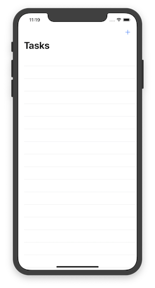
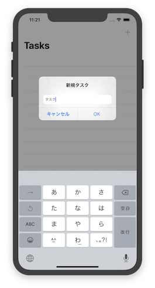
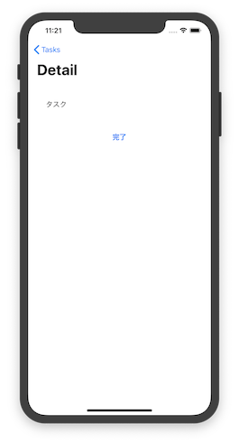

おめでとう!QAはQAエンジニアにしんかした サンプルソース
---

「おめでとう!QAはQAエンジニアにしんかした」内で紹介しているソースコードです。クローンしてお試しください。

# Envioment
以下の環境で動作確認を行いました。

- macOS Mojave 10.14.6
- Xcode11
- iPhone11 Pro シミュレータ iOS13.0

# LICENSE
MIT License.
